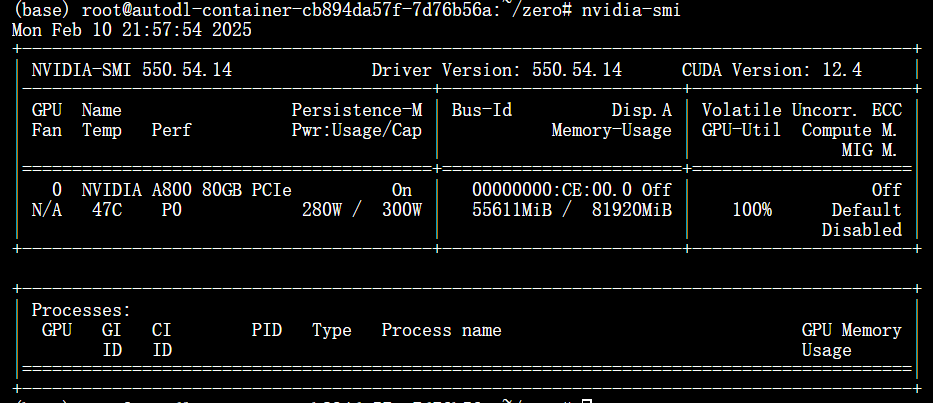
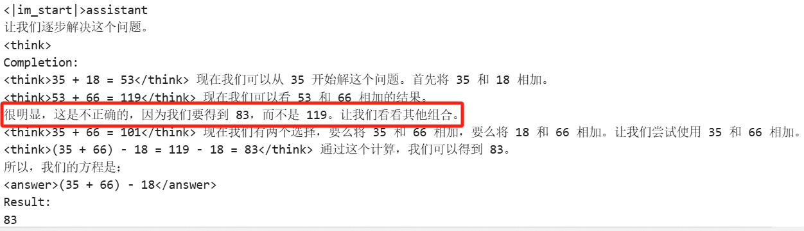
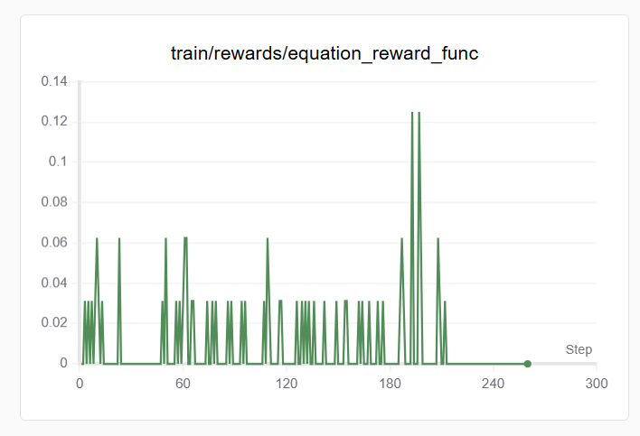
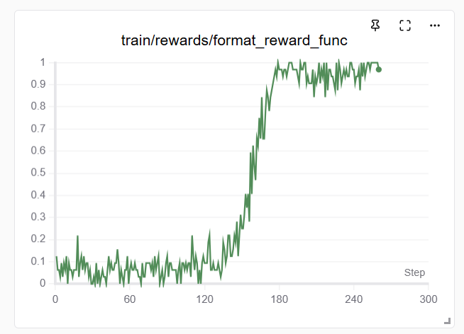
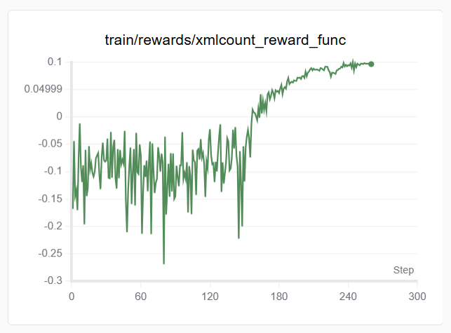

# toy-r1-zero

### 摸鱼时间（不是）尝试的deep-seek-R1-Zero复现

-实验基于Qwen-2.5-1.5B，使用一张80G Nvidia A800，代码来源于Datawhale开源社区，增加了open-r1的reasoning_step_reward和unsloth的xml_reward（缝合）

-采用了GRPO+Lora，本次实验中使用了更大的学习率和更长时间的warm_up

-使用AutoDL云服务器平台，训练大概不到3个小时，成本不到20块钱，训练整体过程显存占用未超过60G

### 观察到一些很有意思的现象

1. <think><answer>的格式还是比较容易学会的，训练开始不久就能观察到不错的输出样例
2. 在训练后期出现了一些疑似aha moment的例子（存疑，有可能是qwen本身的回复）
]
4. 1.5B的模型尊嘟学不会复杂的数学问题（岂可修，还是不行吗！）

### 很特别的现象
1. 增加reasoning_step_reward和提示词中显式增加分阶段论述后，解题成功率明显上升了
2. 训练step过多可能会损害模型性能

### reward 变化曲线

   

